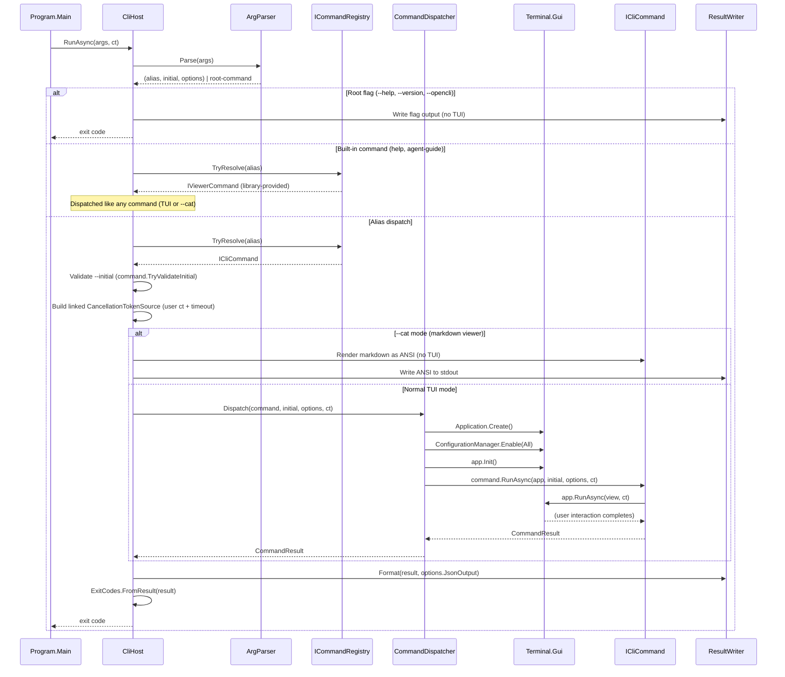

# Terminal.Gui.Cli; Library Spec (Draft)

> Extracted from clet's hosting infrastructure. Enables any Terminal.Gui application to expose Views as scriptable CLI commands with typed JSON output, POSIX exit codes, and AI-agent discoverability.

---

## 0. Status & Audience

**Status:** Proposal / draft spec for discussion.  
**Audience:** Terminal.Gui maintainers, clet maintainers, potential consumers (mdv, community TG tools).  
**Prerequisite:** Terminal.Gui 2.x GA (currently 2.2.2).

---

## 1. Problem Statement

clet has built a complete "TUI-as-CLI-command" hosting system:

- A dynamic command registry with alias lookup
- A hand-rolled argument parser with global + per-command options
- Typed JSON result envelopes (`SchemaV1`)
- POSIX exit codes (0, 1, 2, 65, 74, 130)
- `Application` lifecycle management (create → init → run → dispose)
- Inline vs fullscreen mode selection
- Timeout / cancellation propagation
- Markdown-to-ANSI help rendering
- Terminal escape sanitization for untrusted content
- Output formatting (plain-text vs JSON, file redirection)
- Machine-readable self-description (`--opencli`; OpenCLI format)

This infrastructure is **not clet-specific in purpose**. Any Terminal.Gui app that wants to expose one or more Views as scriptable CLI commands would need to rebuild all of the above. However, the pieces are not trivially separable today. clet's `CommandLineRoot` (~575 lines) hard-codes clet-specific flags (`--allow-file`, `--allow-binary`, `--no-browse`) inline with framework flags; `IsKnownOptionToken()` enumerates all of them in a single `is` expression; the corresponding properties live directly on `CletRunOptions`. Extraction requires rewriting the parser loop from hard-coded to data-driven (consuming `GlobalOptionDescriptor` registrations at runtime), not merely renaming and moving files. The interfaces and command-to-hosting boundary are clean; the parser internals are not.

**Goal:** Extract into `Terminal.Gui.Cli` so that a second TG-based CLI (mdv, a config editor, a diagnostic tool, a community project) can get the full hosting pipeline by adding one PackageReference and implementing one interface.

---

## 2. Design Principles

1. **The library owns the Terminal.Gui lifecycle.** Commands receive `IApplication`; they never call `Application.Create()` or `app.Init()`. The host decides inline vs fullscreen, manages `CancellationToken`, and tears down cleanly. This is the single most important invariant; it's what makes the pipeline correct and commands composable.

2. **No reflection. NativeAOT from day one.** Source-generated JSON. No attribute scanning. Commands self-describe via interface properties (metadata is data, not annotations). The library ships with `<IsAotCompatible>true</IsAotCompatible>`.

3. **Registry is instances, not types.** Commands are registered as constructed objects, not via generic type parameters. This supports dynamic discovery, conditional registration, DI-constructed commands, and plugin loading without requiring a generic type system dance.

4. **The library defines a minimal set of framework options; consumers extend freely.** The library only owns the options it must know about to drive the pipeline (JSON output, timeout, initial value, display mode). Everything else is consumer-defined. The consumer declares additional global options via `CliHostOptions`; the parser collects them into a typed bag the consumer controls. Per-command options are declared as metadata (`CommandOptionDescriptor`) and parsed into a `Dictionary<string, string>`. The command is responsible for interpreting its own options from strings.

5. **The JSON envelope is the contract.** `{ schemaVersion, status, value?, code?, message? }` is the stable wire format. The library controls `schemaVersion`. All consumers of any `Terminal.Gui.Cli`-based tool can rely on the same envelope shape.

6. **Exit codes are POSIX-conventional.** The library maps `CommandStatus` → exit codes. Consumers don't pick exit codes; the library does.

7. **`help` and `agent-guide` are registered commands, not framework-level verbs.** The library ships default implementations (`HelpCommand`, `AgentGuideCommand`) and registers them in the registry during host initialization. They are full `IViewerCommand` implementations; `help` in particular supports interactive TUI mode (fullscreen, scrollable) or `--cat` (markdown rendered as ANSI to stdout). Because they are commands, not hard-coded verbs, consumers can replace them by registering their own implementation under the same alias. The registry rejects *duplicate* aliases but the library registers its defaults first; consumers override by removing then re-registering, or by providing a custom `IHelpProvider` that the default `HelpCommand` delegates to. Structured introspection (`--opencli`) is a root flag, not a command; it's intercepted before dispatch like `--help` and `--version`.

8. **Zero transitive dependencies beyond Terminal.Gui.** The library references `Terminal.Gui` and nothing else.

---

## 3. Engineering Constitution

This library adopts the gui-cs/Editor constitution's principled approach. The rules below are binding on all contributions (human or agent).

### Tenets

- **This is fun.** Levity and humor are welcome; the work is serious but the tone need not be.
- **Principal Engineering excellence.** Contributors strive to be exemplary practitioners: technically fearless, balanced and pragmatic, illuminating complexity, respecting what came before, and having resounding impact.
- **Delightful customer experience.** Customers in priority order: (1) end-users of CLI tools built on this library, (2) human developers consuming the library, (3) AI agents consuming the library, (4) maintainers.
- **This is TG.** The library is an extension of Terminal.Gui, not independent of it. Follow TG conventions. Do not hack around TG limitations; file issues with repros.
- **Performance matters.** CLI startup and dispatch must be fast. No unnecessary allocations on the hot path.
- **.NET citizen.** Leverage latest C# and runtime features. Remain a great citizen of the .NET ecosystem.

### Architectural Rules

| Rule | Statement |
|------|-----------|
| C1 | **Library owns the lifecycle.** Only the dispatcher calls `Application.Create()`, `app.Init()`, `app.RunAsync()`, and disposes `IApplication`. Commands never do. |
| C2 | **No reflection, no code-gen at runtime.** Source-generated JSON only. `[IsAotCompatible]` enforced in CI. |
| C3 | **Public API additions come with a spec brief.** New public surface on `CliHost`, `ICliCommand`, or any shipped type requires a brief in the spec before merge. Stopgaps are marked `[Obsolete]` at introduction. |
| C4 | **No unused public/internal APIs.** If a public or internal member exists, something in `src/` or `examples/` must call it. Tests don't count as a consumer. |
| C5 | **All test projects run in parallel; never touch process globals.** Each test gets its own `IApplication` via `Application.Create()`. Tests must not call static `Application.Init()`, must not call `ConfigurationManager.Enable()`, and must not mutate any static state TG reads. The lone exception: classes that genuinely must mutate a process-global opt out via `[CollectionDefinition(..., DisableParallelization = true)]`. |
| C6 | **Exit codes are library-controlled.** Commands return `CommandResult`; the library maps to exit codes. No command may call `Environment.Exit()`. |
| C7 | **JSON envelope is append-only within a major.** New fields may be added; existing fields are never removed or retyped within a schema version. |
| C8 | **Zero warnings.** `dotnet build` must produce zero warnings in both Debug and Release. Fix at source; suppress only with a written justification. |

### Testing Requirements

| Tier | Project | Purpose | Parallelism |
|------|---------|---------|-------------|
| Unit | `Terminal.Gui.Cli.Tests` | Parser, registry, envelope, exit codes, sanitizer; no TG init | Full parallel |
| Integration | `Terminal.Gui.Cli.IntegrationTests` | CliHost end-to-end with `Application.Create()`; lifecycle, cancellation, dispatch | Full parallel (per-test `IApplication`) |
| Smoke | `Terminal.Gui.Cli.SmokeTests` | Process-level: spawn example app, verify `--help`, `--opencli`, exit codes | Full parallel (separate processes) |

Tests run as executables (xUnit v3): `dotnet run --project tests/<project>`.

### Doc-Update Gate

Before a PR can merge:

- Changed CLI surface, exit codes, JSON envelope, or user-visible behavior? → Update this spec.
- Changed test project layout, harness shape, or layer scope? → Update the test tier table above.
- Made a non-obvious design choice? → Document rationale in the PR description.
- Completed a milestone checkbox? → Tick it on the tracking issue.

---

## 4. Package Identity

```
Package ID:     Terminal.Gui.Cli
Namespace:      Terminal.Gui.Cli
TFM:            net10.0
Dependencies:   Terminal.Gui >= 2.2.0
License:        MIT
Repository:     gui-cs/cli (final home; initially prototyped in gui-cs/clet)
```

---

## 5. Public API Surface

### 5.1 Core Abstractions

```csharp
namespace Terminal.Gui.Cli;

/// <summary>The two kinds of CLI commands the library knows about.</summary>
/// Input commands return a typed value; viewer commands are status-only.
/// "Viewer" does not imply read-only or simple; viewer commands can be fully
/// interactive (editor, config manager) but produce no typed result in the envelope.
public enum CommandKind { Input, Viewer }

/// <summary>Outcome status of a command run.</summary>
public enum CommandStatus { Ok, Cancelled, Error, NoResult }

/// <summary>Metadata descriptor for a per-command option.</summary>
public sealed record CommandOptionDescriptor (
    string Name,
    string? ShortName,
    Type ValueType,
    string Description,
    bool Required,
    string? DefaultValue);

/// <summary>Non-generic result for dispatch and output formatting.</summary>
public readonly record struct CommandResult (
    CommandStatus Status,
    object? Value,
    string? ErrorCode,
    string? ErrorMessage);

/// <summary>Typed result returned by input commands.</summary>
public readonly record struct CommandResult<T> (
    CommandStatus Status,
    T? Value,
    string? ErrorCode,
    string? ErrorMessage);
```

### 5.2 Command Interfaces

```csharp
/// <summary>
/// A CLI command backed by a Terminal.Gui View. Self-describes its alias,
/// options, and kind. Implemented by consumer apps.
/// </summary>
public interface ICliCommand
{
    string PrimaryAlias { get; }
    IReadOnlyList<string> Aliases { get; }
    string Description { get; }
    CommandKind Kind { get; }
    Type ResultType { get; }
    IReadOnlyList<CommandOptionDescriptor> Options { get; }

    /// <summary>Whether this command consumes positional arguments.</summary>
    bool AcceptsPositionalArgs => false;

    /// <summary>Validates the --initial value before the TUI starts.</summary>
    bool TryValidateInitial (string initial, CommandRunOptions options) => true;

    /// <summary>Non-generic dispatch entry point.</summary>
    Task<CommandResult> RunAsync (
        IApplication app,
        string? initial,
        CommandRunOptions options,
        CancellationToken cancellationToken);
}

/// <summary>Typed command that returns a value.</summary>
public interface ICliCommand<TValue> : ICliCommand
{
    new Task<CommandResult<TValue>> RunAsync (
        IApplication app,
        string? initial,
        CommandRunOptions options,
        CancellationToken cancellationToken);

    // Default interface method bridges typed → untyped
    async Task<CommandResult> ICliCommand.RunAsync (
        IApplication app, string? initial,
        CommandRunOptions options, CancellationToken ct)
    {
        CommandResult<TValue> r = await RunAsync (app, initial, options, ct);
        return new (r.Status, r.Value, r.ErrorCode, r.ErrorMessage);
    }
}

/// <summary>
/// Viewer command. Does not return a typed value in the JSON envelope (status-only).
/// Viewers range from simple read-only content display (help, markdown browser) to
/// heavyweight stateful tools (file editor with undo/redo, config manager with
/// validation and save). They are full TUI applications; "viewer" means "no typed
/// result," not "no interactivity."
/// </summary>
public interface IViewerCommand : ICliCommand
{
    // Kind is always CommandKind.Viewer; ResultType is typeof(void).
    // The JSON envelope returns status only (ok, cancelled, error); no value field.

    /// <summary>
    /// Renders content to stdout without launching the TUI. Called when --cat is set.
    /// Return null to indicate --cat is not supported (dispatcher falls through to
    /// normal TUI dispatch). The library skips Application.Create() when this returns
    /// a non-null result.
    /// </summary>
    Task<CommandResult?> RenderCatAsync (
        CommandRunOptions options,
        TextWriter stdout,
        CancellationToken cancellationToken) => Task.FromResult<CommandResult?> (null);
}
```

### 5.3 Command Registry

```csharp
/// <summary>Manages alias → command lookup.</summary>
public interface ICommandRegistry
{
    void Register (ICliCommand command);
    bool TryResolve (string alias, out ICliCommand? command);
    IReadOnlyCollection<ICliCommand> All { get; }
}

/// <summary>Default implementation. Case-insensitive, duplicate-rejecting.</summary>
public sealed class CommandRegistry : ICommandRegistry { /* ... */ }
```

**Bootstrapping note:** `HelpCommand` requires an `ICommandRegistry` parameter (to enumerate commands for rendering). The library constructs it as `new HelpCommand(registry)` and registers it into the same registry. This circular-construction pattern works (clet proves it daily) because the help command reads the registry lazily at invocation time, not at construction. Consumers writing custom help commands should follow the same pattern.

### 5.4 Run Options

```csharp
/// <summary>
/// Parsed options bag passed to commands. The library populates the framework
/// properties it owns; consumer-defined options flow through the Extensions
/// dictionary. Commands access both via this single type.
/// </summary>
public sealed class CommandRunOptions
{
    // --- Framework-owned (the library parses and acts on these) ---

    /// <summary>Pre-fill value for the View.</summary>
    public string? Initial { get; init; }

    /// <summary>Title override for TUI chrome.</summary>
    public string? Title { get; init; }

    /// <summary>Whether to emit JSON envelope instead of plain text.</summary>
    public bool JsonOutput { get; init; }

    /// <summary>Cancel after this duration (parsed from --timeout).</summary>
    public TimeSpan? Timeout { get; init; }

    /// <summary>Force fullscreen (input commands default to inline).</summary>
    public bool Fullscreen { get; init; }

    /// <summary>Render markdown as ANSI to stdout instead of launching the interactive viewer.</summary>
    public bool Cat { get; init; }

    /// <summary>Write result to file instead of stdout.</summary>
    public string? OutputPath { get; init; }

    /// <summary>Constrain inline height.</summary>
    public int? Rows { get; init; }

    /// <summary>Positional arguments (after alias, before options).</summary>
    public IReadOnlyList<string> Arguments { get; init; } = [];

    // --- Per-command options (declared via CommandOptionDescriptor) ---

    /// <summary>Per-command option values keyed by option name.</summary>
    public IReadOnlyDictionary<string, string> CommandOptions { get; init; }
        = new Dictionary<string, string> ();

    // --- Consumer-defined global options (registered via CliHostOptions) ---

    /// <summary>
    /// Extensible bag for consumer-registered global options. Keyed by the
    /// option name (without leading dashes). Each key maps to a list of values
    /// to support repeatable options (e.g. --allow-file path1 --allow-file path2).
    /// For boolean flags, the list contains a single empty string (presence = true).
    /// Consumers register their options in CliHostOptions.GlobalOptions; the parser
    /// accumulates values here on each occurrence.
    /// </summary>
    public IReadOnlyDictionary<string, IReadOnlyList<string>> Extensions { get; init; }
        = new Dictionary<string, IReadOnlyList<string>> ();

    /// <summary>Typed accessor for single-value extension options.</summary>
    public T? GetExtension<T> (string key, Func<string, T> parser, T? defaultValue = default)
    {
        return Extensions.TryGetValue (key, out IReadOnlyList<string>? values) && values.Count > 0
            ? parser (values[^1])  // last wins for single-value options
            : defaultValue;
    }

    /// <summary>Accessor for repeatable extension options (returns all values).</summary>
    public IReadOnlyList<string> GetExtensionList (string key)
    {
        return Extensions.TryGetValue (key, out IReadOnlyList<string>? values)
            ? values
            : [];
    }

    /// <summary>Boolean flag accessor (present = true).</summary>
    public bool HasExtension (string key) => Extensions.ContainsKey (key);
}
```

### 5.5 CLI Host (the framework entry point)

```csharp
/// <summary>
/// The main entry point. Owns parsing, dispatch, lifecycle, and output.
/// </summary>
public sealed class CliHost
{
    public CliHost (Action<CliHostOptions>? configure = null);

    /// <summary>The command registry. Register commands before calling RunAsync.</summary>
    public ICommandRegistry Registry { get; }

    /// <summary>Parse args, dispatch, run the TUI, format output, return exit code.</summary>
    public Task<int> RunAsync (
        string[] args,
        CancellationToken cancellationToken = default,
        TextWriter? stdout = null,
        TextWriter? stderr = null);
}

/// <summary>Configuration options for the host.</summary>
public sealed class CliHostOptions
{
    /// <summary>Application name shown in --help and --version.</summary>
    public string ApplicationName { get; set; } = "app";

    /// <summary>Version string (shown in --version output).</summary>
    public string? Version { get; set; }

    /// <summary>Custom help provider. Null = auto-generated from metadata.</summary>
    public IHelpProvider? HelpProvider { get; set; }

    /// <summary>Maximum characters allowed for --initial. Default: 64K.</summary>
    public int MaxInitialChars { get; set; } = 64 * 1024;

    /// <summary>
    /// Replace a library-provided built-in command (help, agent-guide) with a
    /// consumer-provided implementation. The alias must match a reserved name.
    /// The library deregisters its default and registers the replacement.
    /// </summary>
    public void ReplaceBuiltInCommand (string alias, ICliCommand replacement);

    /// <summary>
    /// Consumer-defined global options. These are parsed by the framework and
    /// placed into CommandRunOptions.Extensions. Consumers register them here;
    /// commands read them via GetExtension/HasExtension.
    /// </summary>
    public List<GlobalOptionDescriptor> GlobalOptions { get; } = [];
}

/// <summary>Describes a consumer-defined global option.</summary>
public sealed record GlobalOptionDescriptor (
    string Name,
    string? ShortName,
    string Description,
    bool IsFlag,
    bool Repeatable = false);
```

**Example: clet registers its domain-specific options as extensions:**

```csharp
CliHost host = new (o =>
{
    o.ApplicationName = "clet";
    o.GlobalOptions.Add (new ("allow-file", null, "Permit file access outside cwd", IsFlag: false, Repeatable: true));
    o.GlobalOptions.Add (new ("allow-binary", null, "Permit binary file content", IsFlag: true));
    o.GlobalOptions.Add (new ("no-browse", null, "Disable link navigation in viewers", IsFlag: true));
});

// In a command:
bool noBrowse = options.HasExtension ("no-browse");
IReadOnlyList<string> allowedFiles = options.GetExtensionList ("allow-file");
// allowedFiles contains all paths from: --allow-file /tmp --allow-file /home/user/docs
```

### 5.6 Help Provider

```csharp
/// <summary>Pluggable help rendering.</summary>
public interface IHelpProvider
{
    /// <summary>Render root-level --help. Return null to use auto-generated.</summary>
    string? GetRootHelp (ICommandRegistry registry);

    /// <summary>Render per-command help. Return null to use auto-generated.</summary>
    string? GetCommandHelp (ICliCommand command);
}

/// <summary>
/// Reads embedded .md resources and renders them to ANSI. Batteries-included
/// for apps that ship help as embedded markdown.
/// </summary>
public sealed class EmbeddedMarkdownHelpProvider : IHelpProvider
{
    public EmbeddedMarkdownHelpProvider (Assembly resourceAssembly);
    /* ... */
}
```

### 5.7 JSON Envelope

```csharp
/// <summary>The stable wire format for CLI output.</summary>
public sealed class JsonEnvelope
{
    public int SchemaVersion { get; } = 1;
    public string Status { get; init; }
    public object? Value { get; init; }
    public string? Code { get; init; }
    public string? Message { get; init; }

    public static JsonEnvelope Ok (object? value = null);
    public static JsonEnvelope Cancelled ();
    public static JsonEnvelope Error (string code, string message);
    public static JsonEnvelope NoResult ();

    /// <summary>Serialize using source-generated context (AOT-safe).</summary>
    public string ToJson ();
}
```

### 5.8 Exit Codes

```csharp
/// <summary>POSIX-conventional exit codes.</summary>
public static class ExitCodes
{
    public const int Ok = 0;
    public const int NoResult = 1;
    public const int UsageError = 2;
    public const int ValidationError = 65;   // EX_DATAERR (sysexits.h)
    public const int IoError = 74;           // EX_IOERR
    public const int Cancelled = 130;        // 128 + SIGINT

    public static int FromResult (CommandResult result);
}
```

### 5.9 Utilities (public but non-core)

```csharp
/// <summary>Strips dangerous terminal escape sequences from untrusted content.</summary>
public static class TerminalEscapeSanitizer
{
    public static string? Sanitize (string? input);
    public static string SanitizeRenderedOutput (string renderedAnsi);
}

/// <summary>
/// Thin wrapper around Terminal.Gui's Markdown view render-to-ANSI API.
/// This utility exists for convenience; it delegates entirely to TG's Markdown class.
/// If TG ships a public static render-to-ANSI method natively, this wrapper becomes
/// a one-line passthrough and may be deprecated in favor of calling TG directly.
/// Prerequisite: TG must expose markdown-to-ANSI rendering (tracked as a TG feature request).
/// </summary>
public static class MarkdownRenderer
{
    public static void RenderToAnsi (string markdown, TextWriter output);
}

/// <summary>Maps CLR types to stable wire-format names (string, int, bool, etc.).</summary>
public static class TypeNames
{
    public static string WireName (Type type);
}
```

---

## 6. CLI Grammar (What the Host Parses)

The library defines a fixed grammar. Consumer apps get this for free:

```
<app> <alias> [positional...] [options]
<app> help [<alias>] [--cat]     # library-provided IViewerCommand (interactive TUI or ANSI)
<app> agent-guide [--json]       # library-provided IViewerCommand (non-interactive)
<app> --help | -h                # root flag (no TUI; writes to stdout)
<app> --version                  # root flag (no TUI; writes to stdout)
<app> --opencli                  # root flag (emits OpenCLI JSON document to stdout)
```

`help` and `agent-guide` are registered commands (not framework-level verbs). They go through the same dispatch path as consumer commands. `--help`, `--version`, and `--opencli` are root flags intercepted before dispatch.

### 6.1 Framework-Owned Global Options

These are built into the library; the parser knows about them intrinsically:

| Flag | Short | Value | Purpose |
|------|-------|-------|---------|
| `--json` | `-j` | (none) | Output JSON envelope instead of plain text |
| `--initial` | `-i` | `<value>` | Pre-fill the View with a value |
| `--title` | `-t` | `<text>` | Override the title shown in the TUI chrome |
| `--timeout` | (none) | `<duration>` | Cancel after duration (30s, 500ms, 1m) |
| `--fullscreen` | `-f` | (none) | Force fullscreen (input commands default to inline) |
| `--cat` | (none) | (none) | Render markdown content as ANSI to stdout instead of launching the interactive viewer |
| `--output` | `-o` | `<path>` | Write result to file instead of stdout |
| `--rows` | `-r` | `<n>` | Constrain inline height |
| `--opencli` | (none) | (none) | Emit OpenCLI JSON document describing all commands and exit (root flag; no dispatch) |

### 6.2 Consumer-Registered Global Options

Consumers declare additional global options via `CliHostOptions.GlobalOptions`. The parser recognizes them and populates `CommandRunOptions.Extensions`. Examples from clet:

| Flag | Value | Purpose |
|------|-------|---------|
| `--allow-file` | `<path>` (repeatable) | Permit file access outside cwd |
| `--allow-binary` | (none; flag) | Permit binary file content |
| `--no-browse` | (none; flag) | Disable link navigation in viewers |

Any consumer can add their own. The parser rejects unknown options (exit 2) by checking both the framework set, the consumer-registered set, and the dispatched command's per-command descriptors.

**Parser accumulation for repeatable options:** When `Repeatable = true` on a `GlobalOptionDescriptor`, the parser appends each occurrence to the list in `Extensions`. For example, `--allow-file /tmp --allow-file /home` produces `Extensions["allow-file"] = ["/tmp", "/home"]`. Non-repeatable options with multiple occurrences: last value wins (single-element list). Flags: presence adds an empty-string entry (`Extensions["no-browse"] = [""]`).

### 6.3 Per-Command Options

Anything of the form `--<name> <value>` not matching a global option is validated against the dispatched command's `Options` descriptors. Unknown options → exit 2.

### 6.4 Parsing Additions (vs clet today)

| Feature | Status in clet | Proposed for library |
|---------|----------------|---------------------|
| `--option=value` syntax | Not supported | **Add** (standard POSIX; trivial; applies to both global and per-command options uniformly) |
| `--` separator (end of options) | Not supported | **Add** (everything after `--` is positional) |
| Short option bundling (`-jf`) | Not supported | **Defer** (complex; rarely needed for TUI commands) |
| Environment variable fallback | Not supported | **Defer** (complexity vs benefit unclear) |
| stdin → `--initial` piping | Supported for `md` viewer in clet | **Defer** to v1.1. Standard CLI UX (`echo "value" \| myapp command` equivalent to `--initial`). Requires detecting non-TTY stdin and reading it, which conflicts with TUI keyboard input. Design needs a `--stdin` explicit opt-in flag or pipe detection heuristic. |

---

## 7. Execution Pipeline



### 7.1 Lifecycle Details

1. **ConfigurationManager.Enable(All)** is called inside the dispatcher, not by commands. If it throws (corrupt config), the dispatcher falls back to hard-coded defaults; a bad config never prevents a command from running.

2. **AppModel selection:** Input commands default to `AppModel.Inline`; viewer commands default to `AppModel.FullScreen`. `--fullscreen` forces fullscreen for inputs. This is resolved by the dispatcher before `app.Init()`.

3. **IApplication disposal** is always in a `using` block inside the dispatcher. Commands cannot leak it.

4. **Cancellation ordering:** OperationCanceledException from `app.RunAsync` → `CommandStatus.Cancelled`. The library ensures this is caught in the dispatcher, not by the consumer.

---

## 8. AI Agent Discovery (3-Part Model)

The library adopts a 3-part discovery model (pioneered by gui-cs/tuirec) that gives AI agents progressively deeper context about the tool:

### 8.1 Part 1: `llms.txt` (Orientation)

The consumer ships a `llms.txt` file in their repo root (and optionally serves it at `<domain>/llms.txt`). This is a brief, plain-text document sized to fit in an LLM context window (~2K chars). It answers: what is this tool, how do I install it, what are the key flags, and where do I go for more.

The library does not generate this file; the consumer authors it. But the convention is part of the contract: any `Terminal.Gui.Cli`-based tool SHOULD ship `llms.txt`.

Example structure:

```
# myapp

> One-line description of what the tool does.

## Install
...

## Quick start
...

## AI Agent usage
Run `myapp agent-guide` to get the full usage reference.

## Key flags
...

## Links
- Repository: ...
- Agent guide: agent/AGENT-GUIDE.md
```

### 8.2 Part 2: `<app> agent-guide` (Runnable Reference)

The library ships a default `AgentGuideCommand` (registered as `agent-guide` alongside `HelpCommand`). When invoked, it prints the consumer's full agent-usage guide to stdout as plain text (no TUI). This is the machine-retrievable equivalent of running `--help` but for AI agents; it covers semantics, examples, best practices, and gotchas that `--help` is too terse for.

The content is an embedded markdown resource supplied by the consumer via `CliHostOptions`:

```csharp
public sealed class CliHostOptions
{
    // ... existing properties ...

    /// <summary>
    /// Embedded resource name (or literal content) for the agent-guide verb.
    /// When set, `<app> agent-guide` prints this to stdout. When null, the
    /// verb is not registered.
    /// </summary>
    public string? AgentGuide { get; set; }

    /// <summary>
    /// If true, AgentGuide is treated as an embedded resource name to load
    /// from the consumer's assembly. If false, it's literal content.
    /// </summary>
    public bool AgentGuideIsResource { get; set; } = true;
}
```

Behavior:
- `<app> agent-guide` prints the guide to stdout and exits 0.
- `<app> agent-guide --json` wraps the guide text in the JSON envelope (`{ schemaVersion: 1, status: "ok", value: "..." }`).
- If the consumer does not set `AgentGuide`, the library does **not** register `AgentGuideCommand` in the registry. The alias is simply absent; invoking it produces "unknown command" (exit 2). This is conditional registration, not "registered but errors."

### 8.3 Part 3: `<app> --opencli` (Structured Introspection via OpenCLI)

Every `Terminal.Gui.Cli`-based tool supports the `--opencli` flag, emitting an [OpenCLI Specification](https://github.com/spectreconsole/open-cli) document (JSON). OpenCLI is an emerging standard (inspired by OpenAPI) that defines a platform-agnostic, machine-readable description of a CLI's commands, arguments, options, and exit codes. By conforming to OpenCLI rather than inventing a bespoke introspection format, `Terminal.Gui.Cli` tools are automatically compatible with any OpenCLI-aware tooling (MCP servers, doc generators, auto-completion engines, AI agents).

```json
{
  "opencli": "0.1",
  "info": {
    "title": "clet",
    "version": "0.11.0",
    "description": "Terminal.Gui Views as scriptable CLI commands"
  },
  "command": {
    "name": "clet",
    "commands": [
      {
        "name": "select",
        "aliases": ["select"],
        "description": "Presents a list of options and returns the selected item.",
        "interactive": true,
        "arguments": [
          {
            "name": "items",
            "description": "Space-separated list of items to select from",
            "required": false,
            "arity": { "minimum": 0, "maximum": null }
          }
        ],
        "options": [
          {
            "name": "--options",
            "aliases": ["-o"],
            "description": "Comma-separated list of options to display",
            "arguments": [{ "name": "value", "required": true }]
          }
        ],
        "exitCodes": [
          { "code": 0, "description": "Success; selected value in stdout" },
          { "code": 2, "description": "Usage error" },
          { "code": 130, "description": "Cancelled (Esc/Ctrl-C)" }
        ],
        "metadata": [
          { "name": "kind", "value": "input" },
          { "name": "resultType", "value": "string" }
        ]
      }
    ],
    "options": [
      {
        "name": "--json",
        "aliases": ["-j"],
        "description": "Output JSON envelope instead of plain text",
        "recursive": true
      },
      {
        "name": "--initial",
        "aliases": ["-i"],
        "description": "Pre-fill the View with a value",
        "recursive": true,
        "arguments": [{ "name": "value", "required": true }]
      }
    ],
    "exitCodes": [
      { "code": 0, "description": "Success" },
      { "code": 2, "description": "Usage error (unknown command, bad option)" },
      { "code": 130, "description": "Cancelled" }
    ]
  }
}
```

**Implementation note:** The OpenCLI document is built at runtime from registry metadata (the same `ICliCommand.Aliases`, `Options`, `Description` etc. that commands already expose). The JSON is hand-built using `StringBuilder` with manual escaping; this is a deliberate AOT-friendliness choice that avoids requiring a `JsonSerializerContext` entry for the introspection format. The OpenCLI schema is simple and stable enough that hand-serialization is correct and maintainable.

**TG.Cli-specific extensions via `metadata`:** OpenCLI's `metadata` array carries key-value pairs for domain-specific information. `Terminal.Gui.Cli` uses this to convey `kind` (input/viewer) and `resultType` (the JSON wire type name for input commands). Agents that understand `Terminal.Gui.Cli` semantics read these; generic OpenCLI consumers ignore them.

An agent calls `<tool> --opencli` once per session, caches the result, and knows exactly which commands exist, what options they take, what exit codes to expect, and what result shapes to parse.

### 8.4 How the 3 Parts Compose

| Layer | When an agent uses it | What it gets |
|-------|----------------------|--------------|
| `llms.txt` | Pre-loaded into context (repo checkout, web fetch, or tool docs) | Orientation: what the tool is, how to invoke it, pointer to deeper layers |
| `agent-guide` | Called once at start of a task; output cached | Full usage reference: semantics, examples, edge cases, best practices |
| `--opencli` | Called once per session; output cached | Structured OpenCLI document: commands, option schemas, exit codes, result types |

The three layers are deliberately redundant in different ways. `llms.txt` is human-authored prose optimized for LLM comprehension. `agent-guide` is detailed reference optimized for correctness. `--opencli` is a machine-structured, standards-conformant document optimized for programmatic decision-making. An agent can use any combination depending on its context budget and task.

---

## 9. Input Command Runner Helper

The library ships an `InputCommandRunner` utility (equivalent to clet's `InputCletRunner`) that handles the common pattern:

```csharp
public static class InputCommandRunner
{
    /// <summary>
    /// Standard boilerplate: style the wrapper, bind Enter, run, extract result.
    /// </summary>
    public static Task<CommandResult<TValue>> RunAsync<TControl, TRawResult, TValue> (
        IApplication app,
        RunnableWrapper<TControl, TRawResult> wrapper,
        CommandRunOptions options,
        string defaultTitle,
        CancellationToken cancellationToken,
        Func<TRawResult?, CommandResult<TValue>> resultMapper,
        bool addEnterBinding = true)
        where TControl : View, new();
}
```

This encapsulates:
- Pre-cancellation check
- Wrapper styling (title, border, width, scheme; see below)
- Enter key binding
- `app.RunAsync(wrapper, ct)`
- OperationCanceledException catch
- Post-cancel check
- Result mapping

### 9.1 Opinionated Defaults and Consumer Override

`InputCommandRunner` applies opinionated styling defaults to the wrapper before running it:

```csharp
// Applied by InputCommandRunner (library defaults):
wrapper.Title = options.Title ?? defaultTitle;
wrapper.Width = Dim.Fill ();
wrapper.BorderStyle = LineStyle.Rounded;
wrapper.Border.Thickness = new Thickness (0, 1, 0, 0);
```

These defaults give a consistent look across all `Terminal.Gui.Cli`-based tools. However, consumers must be able to override them without the library providing custom callbacks or events.

**Override mechanism:** `RunnableWrapper<TControl, TRawResult>` inherits from `View`, which fires `Initialized` after the View hierarchy is set up. A consumer that wants different styling simply subscribes to `Initialized` on the wrapper before passing it to `InputCommandRunner`:

```csharp
RunnableWrapper<OptionSelector, int?> wrapper = new (selector);

// Override library defaults after they're applied:
wrapper.Initialized += (s, e) =>
{
    wrapper.BorderStyle = LineStyle.Double;
    wrapper.SchemeName = "MyCustomScheme";
    wrapper.Border.Thickness = new Thickness (1);
};

return await InputCommandRunner.RunAsync (app, wrapper, options, "Pick one", ct, resultMapper);
```

The library does **not** add new events or callbacks for styling. The standard TG View lifecycle (`Initialized`) is sufficient. This matches how TG applications normally customize Views: set properties before `Init`, or subscribe to `Initialized` for post-init adjustments.

**Note on scheme names:** clet uses `CletStyling.BaseSchemeName` (resolves to the TG `Schemes.Base` name). The library applies the current TG base scheme by default. Consumers override by setting `wrapper.SchemeName` to any scheme registered in their `ConfigurationManager` setup.

### 9.2 Example: Minimal Input Command

Commands that wrap a single TG View reduce to ~20 lines:

```csharp
public sealed class MyPickerCommand : ICliCommand<string?>
{
    // ... metadata properties ...

    public async Task<CommandResult<string?>> RunAsync (
        IApplication app, string? initial, CommandRunOptions options, CancellationToken ct)
    {
        OptionSelector selector = new () { Labels = ParseLabels (options) };
        RunnableWrapper<OptionSelector, int?> wrapper = new (selector);

        return await InputCommandRunner.RunAsync (
            app, wrapper, options, "Pick one", ct,
            result => result is { } idx
                ? new (CommandStatus.Ok, selector.Labels[idx.Value], null, null)
                : new (CommandStatus.NoResult, null, null, null));
    }
}
```

---

## 10. What the Library Does NOT Do

| Concern | Rationale |
|---------|-----------|
| Define concrete commands | Consumer's job. clet ships 18 (14 input commands + 4 viewer commands including a full file editor with undo/redo and a config manager); mdv ships 1; your tool ships N. |
| Ship a general-purpose markdown file viewer | The library ships `HelpCommand` and `AgentGuideCommand` as built-in viewers, but not an arbitrary file-browsing `md` command. Consumers who want `myapp md FILE` register their own `IViewerCommand` handling file resolution, access policy, and glob expansion. The library provides `MarkdownRenderer` as a utility; it does not own file reading. |
| Manage file access policy | Domain-specific to clet (threat model for AI agents). Consumer can add their own. |
| Provide logging | Consumer wires up `ILogger` if they want. Library is silent. |
| Auto-discover commands via reflection/source-gen | Explicit registration only (AOT-safe, transparent). |
| Provide DI container | Consumer constructs commands however they like before registering. |
| Own the ConfigurationManager config file path | Consumer sets `ConfigurationManager.AppName` before calling `RunAsync`. Library calls `Enable(All)` inside the dispatcher. |

---

## 11. Project Structure

```
Terminal.Gui.Cli/
├── Terminal.Gui.Cli.csproj
├── Abstractions/
│     ICliCommand.cs
│     IViewerCommand.cs
│     ICommandRegistry.cs
│     CommandKind.cs
│     CommandStatus.cs
│     CommandResult.cs          (non-generic + generic)
│     CommandRunOptions.cs
│     CommandOptionDescriptor.cs
├── Registry/
│     CommandRegistry.cs
├── Hosting/
│     CliHost.cs
│     CliHostOptions.cs
│     ArgParser.cs             (extracted from CommandLineRoot)
│     CommandDispatcher.cs     (extracted from AliasDispatcher)
│     ExitCodes.cs
│     InputCommandRunner.cs    (extracted from InputCletRunner)
├── Output/
│     ResultWriter.cs          (extracted from OutputFormatter)
│     JsonEnvelope.cs          (extracted from SchemaV1)
│     CliJsonContext.cs        (source-generated)
│     TypeNames.cs             (extracted from CletTypeNames)
│     OpenCliWriter.cs         (hand-built OpenCLI JSON from registry metadata)
├── Commands/
│     HelpCommand.cs           (IViewerCommand; interactive TUI or --cat)
│     AgentGuideCommand.cs     (IViewerCommand; non-interactive)
├── Help/
│     IHelpProvider.cs
│     MetadataHelpProvider.cs  (auto-generated from registry)
│     EmbeddedMarkdownHelpProvider.cs
│     MarkdownRenderer.cs      (extracted from MarkdownHelpRenderer)
├── Security/
│     TerminalEscapeSanitizer.cs
└── Properties/
      AssemblyInfo.cs
```

Estimated size: **~3000 lines** (excluding tests).

---

## 12. Test Strategy

### 12.1 Unit tests (no TG init)

- ArgParser: edge cases, `--option=value`, `--`, unknown options, timeout parsing
- CommandRegistry: registration, duplicate rejection, case-insensitive lookup
- ResultWriter: JSON envelope correctness, plain-text formatting, file output
- ExitCodes: mapping from every CommandStatus × error code combination
- TypeNames: CLR type → wire name
- TerminalEscapeSanitizer: security cases (OSC, CSI, C1 pairs)
- JsonEnvelope: AOT serialization round-trip

### 12.2 Integration tests (TG init, no real terminal)

- CliHost end-to-end with mock commands: verify exit codes, stdout content
- Dispatcher lifecycle: ConfigurationManager failure fallback, cancellation propagation
- InputCommandRunner: pre-cancelled token, timeout, normal completion
- Help rendering: metadata-generated and embedded-markdown paths

### 12.3 Smoke tests (process-level)

- A test harness app (`Terminal.Gui.Cli.TestApp`) that registers a few trivial commands
- Spawn the binary, verify `--help`, `--version`, `--opencli`, `<alias> --json --timeout 1s`

---

## 13. Implementation Strategy

### Stage A: Prove the API in clet (single PR)

The library is first implemented as a new project **inside the clet repo** at `src/Terminal.Gui.Cli/`. This avoids multi-repo coordination overhead while the API is still fluid:

1. Create `src/Terminal.Gui.Cli/Terminal.Gui.Cli.csproj` (class library, net10.0, `<IsAotCompatible>true</IsAotCompatible>`).
2. Extract and rename: abstractions, registry, dispatcher, output formatter, JSON envelope, exit codes, help rendering, sanitizer, `InputCommandRunner`.
3. **Rewrite `ArgParser` from scratch** (not extract). clet's `CommandLineRoot` is hard-coded: `IsKnownOptionToken()` enumerates every flag in a single `is` expression, consumer-specific flags (`--allow-file`, `--allow-binary`, `--no-browse`) are parsed inline alongside framework flags, and their values land directly on `CletRunOptions` properties. The library's `ArgParser` must instead be data-driven: framework-owned flags are a fixed set; consumer-registered flags come from `CliHostOptions.GlobalOptions` (a list of `GlobalOptionDescriptor`); per-command flags come from `CommandOptionDescriptor` metadata. The parser loop iterates registered descriptors rather than hard-coding flag names. This is the single largest extraction cost.
4. All extracted types become `public`.
5. Add `tests/Terminal.Gui.Cli.Tests/` (unit + integration tests for the library in isolation).
6. clet's `src/Clet/` takes a `<ProjectReference>` to the sibling library.
7. Refactor clet to consume the library: delete duplicated hosting code, adopt `ICliCommand<T>`, `CommandRunOptions`, `CliHost`, etc.
8. All existing clet tests must pass (unit, config, integration, smoke, UI).

At this stage the library is **not published to NuGet**; it's purely a build-time dependency within the solution.

### Stage B: Rewrite implementation in gui-cs/cli

Once the API is proven (clet works, rough edges discovered and fixed), create `gui-cs/cli` as a new repo and **rewrite the implementation from scratch**. The API design (interfaces, types, method signatures, JSON envelope shape, exit codes) carries forward unchanged; only the internal implementation is rewritten.

**Why rewrite the impl but keep the API?** AI-generated code (which Stage A will largely be) accumulates implementation slop: inconsistent error paths, redundant allocations, unclear variable names, slightly-off abstractions that "work but aren't right." A clean-room re-implementation on a second pass produces tighter, more intentional code because the author now fully understands the problem space. The API surface is already validated by real usage in clet; rewriting it would be churn, not improvement.

**What "rewrite" means concretely:**
- The public API surface (§5) is copied verbatim (same interfaces, same types, same method signatures).
- The spec (this document) is updated with any lessons learned from Stage A (new rules, adjusted defaults, dropped features that proved unnecessary).
- Every `.cs` file in `src/` is written fresh, not copied from the clet repo. The goal is zero slop: clean control flow, minimal allocations, clear naming, no dead code paths, no "TODO" comments.
- Tests are written fresh against the spec, not ported. This catches spec-vs-implementation drift that ported tests would hide.

The new repo adopts TG.Editor's CI/CD and release workflow model:

1. **Repo structure** mirrors TG.Editor:
   - `src/Terminal.Gui.Cli/` (the library)
   - `tests/Terminal.Gui.Cli.Tests/`
   - `tests/Terminal.Gui.Cli.IntegrationTests/`
   - `examples/` (minimal example app proving the pipeline)
   - `Directory.Build.props` with `<Version>` base and `<TerminalGuiVersion>` pin
   - `.editorconfig` (shared gui-cs style)

2. **CI workflow** (`.github/workflows/ci.yml`):
   - Matrix: ubuntu-latest, macos-latest, windows-latest
   - Steps: restore, build, `dotnet format --verify-no-changes`, run all test projects
   - `DisableRealDriverIO=1` for Windows runners (no TTY)
   - AOT publish of example app per RID to validate trimming

3. **Release workflow** (`.github/workflows/release.yml`):
   - Triggers: `v*` tag push (stable), `develop` branch push (rolling prerelease)
   - Version computation: tag → strip `v`; develop → `<Version>.<run_number>`
   - Cross-platform build-and-test matrix (Release config)
   - `dotnet pack` → push to NuGet with `--skip-duplicate`
   - Upload release archives to GitHub Release

4. **Prepare-release workflow** (`.github/workflows/prepare-release.yml`):
   - Manual dispatch with release_type (beta/rc/stable) and optional version override
   - Creates `release/v<version>` branch from develop
   - Opens PR targeting main with merge checklist

5. **Finalize-release workflow** (`.github/workflows/finalize-release.yml`):
   - Triggers on release PR merge to main
   - Creates annotated tag, GitHub Release, deletes release branch
   - Opens back-merge PR (main → develop)

6. **Downstream notification**:
   - On successful publish, dispatch `cli-published` event to `gui-cs/clet` (and any other consumers) so they can rebuild against the new version

### Stage C: clet migrates to the published package

Once `gui-cs/cli` publishes its first prerelease to NuGet:

1. clet replaces the `<ProjectReference>` with `<PackageReference Include="Terminal.Gui.Cli" Version="..." />`.
2. Delete `src/Terminal.Gui.Cli/` and `tests/Terminal.Gui.Cli.Tests/` from the clet repo.
3. `Program.cs` becomes:

```csharp
using Terminal.Gui.Cli;

internal static class Program
{
    public static async Task<int> Main (string[] args)
    {
        CletLogging.Initialize ();

        using CancellationTokenSource cts = new ();
        Console.CancelKeyPress += (_, e) => { e.Cancel = true; cts.Cancel (); };

        CliHost host = new (o =>
        {
            o.ApplicationName = "clet";
            o.Version = VersionInfo.GetCletVersion ();
            o.HelpProvider = new EmbeddedMarkdownHelpProvider (typeof (Program).Assembly);
            o.AgentGuide = "AgentGuide.md";
            o.GlobalOptions.Add (new ("allow-file", null, "Permit file access outside cwd", IsFlag: false, Repeatable: true));
            o.GlobalOptions.Add (new ("allow-binary", null, "Permit binary file content", IsFlag: true));
            o.GlobalOptions.Add (new ("no-browse", null, "Disable link navigation in viewers", IsFlag: true));
        });

        BuiltInClets.RegisterAll (host.Registry);

        return await host.RunAsync (args, cts.Token);
    }
}
```

4. Each clet class: `IClet<T>` → `ICliCommand<T>`, `CletRunOptions` → `CommandRunOptions`, etc. (mechanical find-replace from Stage A already done).

### Stage D: Second consumer validates generality

mdv (or another tool) adds `Terminal.Gui.Cli` and ships a single viewer command. This proves the API is not clet-shaped in ways that don't generalize. Only after this validation does the library move to 1.0 stable.

---

## 14. Versioning & Compatibility

Versioning follows the TG.Editor model:

| Concern | Policy |
|---------|--------|
| Version source of truth | `<Version>` in `Directory.Build.props` (e.g. `1.0.0-develop`) |
| Develop branch pushes | Append `.<run_number>` → rolling prerelease (e.g. `1.0.0-develop.42`) |
| Tag pushes (`v*`) | Strip `v` prefix → stable or pre-release version (e.g. `1.0.0`, `1.0.0-rc.1`) |
| Terminal.Gui compatibility | `<TerminalGuiVersion>` property in Directory.Build.props; CI can override via `-p:TerminalGuiVersion=<x>` |
| Library major version | Tied to `schemaVersion`. Library 1.x = schema v1. |
| Library minor version | New features (new global options, new helper methods). |
| Library patch version | Bug fixes, TG compatibility bumps. |
| Breaking changes | Additive only within a major. |
| AOT compatibility | Enforced by `<IsAotCompatible>true</IsAotCompatible>` and CI AOT-publish of example app. |
| Release process | prepare-release (manual dispatch) → release PR → merge to main → finalize-release (tag + GitHub Release + back-merge) → release workflow (NuGet push + downstream dispatch) |

---

## 15. Risks & Mitigations

| Risk | Severity | Mitigation |
|------|----------|-----------|
| API shaped too tightly around clet's needs | High | Phase 3 (second consumer) validates generality before 1.0 stable. Ship as prerelease until validated. |
| Parser extraction is a rewrite, not a rename | High | clet's `CommandLineRoot` hard-codes domain flags inline; `ArgParser` must be data-driven. Budget this as new code, not extraction. Mitigate by writing `ArgParser` tests first (TDD against the spec), not by copying clet's parser. |
| `IApplication` API changes in TG 2.x | Medium | Pin floor version. Library's dispatcher wraps the `IApplication` calls, so consumer commands are insulated. |
| `RunnableWrapper<T,R>` is a TG type that may change | Medium | `InputCommandRunner` wraps it; if TG changes the API, only the runner needs updating, not every consumer command. |
| ConfigurationManager global state pollution | Low | Dispatcher isolates CM calls. On failure, falls back to defaults. Consumer never calls CM directly. |
| Binary size increase for trivial single-command apps | Low | Library is ~3K lines, no transitive deps. Marginal AOT size impact. |
| Premature abstraction (only clet consumes it for months) | Medium | Ship as `-preview` or `-rc`. Don't commit to stable until a second consumer exists. |

---

## 16. Resolved Design Questions

1. **Where does the repo live?**

   **Decision:** Two-stage approach. First: implemented as `src/Terminal.Gui.Cli/` inside the clet repo (ProjectReference; not published). Once proven, rewritten from scratch in a new `gui-cs/cli` repo that publishes `Terminal.Gui.Cli` to NuGet. The new repo adopts TG.Editor's CI/CD model (ci.yml, release.yml, prepare-release.yml, finalize-release.yml with develop/main branching, version in Directory.Build.props, downstream dispatch).

2. **Should `InputCommandRunner` reference `RunnableWrapper` directly?**

   **Decision:** Yes. Reference `RunnableWrapper` directly. It's a core TG v2 primitive. The library already requires TG >= 2.2.0.

3. **Should the library handle `Ctrl+C` / `CancellationTokenSource` creation?**

   **Decision:** No; leave to consumer. `CliHost.RunAsync` accepts a `CancellationToken` parameter. The consumer wires up `Console.CancelKeyPress` in their `Main`. This keeps the library testable (tests pass pre-cancelled tokens).

4. **Should `--cat` mode be part of the library or a consumer-specific extension?**

   **Decision:** Include it. `--cat` renders markdown content as ANSI escape sequences to stdout (no TUI launched). It only applies to viewer commands whose content is markdown; input commands and non-markdown viewers ignore it. The `MarkdownRenderer` utility is useful standalone. If a viewer doesn't have markdown content, `--cat` is a no-op or returns `CommandStatus.Error`.

5. **Should structured introspection be a command or a root flag?**

   **Decision:** Root flag (`--opencli`). Structured introspection emits an OpenCLI-conformant JSON document and exits immediately; it has no interactive component and no need for TG lifecycle. `help` and `agent-guide` remain registered commands (`IViewerCommand`). `help` is interactive TUI (or `--cat` for ANSI output); `agent-guide` is non-interactive. Consumer aliases cannot shadow `help` or `agent-guide` by default (registry rejects duplicates on reserved names), but consumers can explicitly replace them via `CliHostOptions.ReplaceBuiltInCommand(alias, instance)`. This matches clet's existing model where `HelpClet` is an `IViewerClet` with full interactive capability (`clet help select` opens a fullscreen viewer; `clet help select --cat` prints ANSI to stdout).

---

## 17. Timeline (Proposed)

| Stage | Milestone | Criteria |
|-------|-----------|----------|
| A | Prove in clet | `src/Terminal.Gui.Cli/` exists in clet repo; all clet tests pass against it; API stabilizes through real usage |
| B | Rewrite in gui-cs/cli | Clean-room implementation from scratch; CI/CD workflows (ci, release, prepare-release, finalize-release) modeled on TG.Editor; library builds and tests pass on all 3 OS |
| C | clet migrates to NuGet package | clet switches from ProjectReference to PackageReference; `src/Terminal.Gui.Cli/` removed from clet repo |
| D | Second consumer | mdv (or another tool) proves the API generalizes |
| E | 1.0 stable | After ≥2 consumers, ≥1 month of prerelease usage, spec rewritten based on learnings |

---

## 18. Alternative Libraries

This library solves a specific problem (parse args; launch a TUI; return typed results). It is not a general-purpose CLI framework. For context, here is how it compares to existing options:

| | System.CommandLine | Spectre.Console.Cli | Cocona | Terminal.Gui.Cli |
|-|-------------------|---------------------|--------|------------------|
| **Purpose** | Parse args; invoke handlers | Parse args; execute logic; print output | Convention-based CLI from methods | Parse args; launch TUI; return typed result |
| **Commands** | Statically declared symbols | Statically declared via `CommandSettings` types | Methods as commands | Dynamically registered instances with metadata |
| **Terminal ownership** | None (consumer prints) | Owns terminal for output formatting | None (consumer prints) | Delegates to Terminal.Gui for TUI rendering |
| **Options** | Typed at compile time | Typed at compile time via attributes | Typed via method parameters | String bags, interpreted by commands at runtime |
| **AOT story** | Good (trimming-safe) | Improving but relies on reflection | Relies on reflection | AOT-first, no reflection |
| **Use case** | Traditional CLI tools | Traditional CLI tools (git, dotnet, etc.) | Simple CLI tools with minimal ceremony | TUI-prompt tools (fzf-like pickers, interactive editors, browsers) |

If your app does not use Terminal.Gui and does not present a TUI, use one of the general-purpose libraries above. If your app wraps TG Views as CLI commands, use `Terminal.Gui.Cli`.
